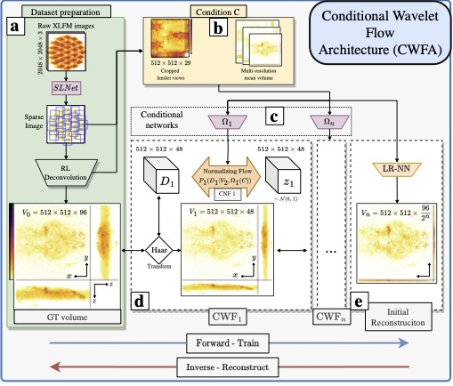

[![Apache License][license-shield]][license-url]
[![Google Scholar][gs-shield]][gs-url]
[![PDF][arxiv-shield]][arxiv-url]

# Conditional Wavelet Flow architecture for 3D reconstruction of XLFM images (CWFA)

* [About the Project](#about)
* [Installation](#installation)
* [Workflow](#workflow)
* [The dataset](#the-dataset)
* [Examples](#examples)
* [Citing this work](#citing-this-work)
* [Contact](#contact)

## About




## Installation

## Workflow

## The dataset
hola

## Examples
hola


## Citing this work
```bibtex
@article{pageWaveBlocks2020,
    author = {Page Vizcaino, Josue and Symvoulidis, Panagiotis and Jelten, Jonas and Wang, Zeguan and Favaro, Paolo and Boyden, Edward S. and Lasser Tobias},
    booktitle = {arXiv},
    title = {{F}ast light-field 3D microscopy with out-of-distribution detection and adaptation through {C}onditional {N}ormalizing {F}lows},
    year = {2023}
}
```
## Contact
Josue Page - pv.josue@gmail.com

[forks-shield]: https://img.shields.io/github/forks/othneildrew/Best-README-Template.svg?style=flat-square
[forks-url]: https://github.com/pvjosue/WaveBlocks/network/members
[stars-shield]: https://img.shields.io/github/stars/othneildrew/Best-README-Template.svg?style=flat-square
[stars-url]: https://github.com/pvjosue/WaveBlocks/stargazers
[issues-shield]: https://img.shields.io/github/issues/othneildrew/Best-README-Template.svg?style=flat-square
[issues-url]: https://github.com/pvjosue/WaveBlocks/issues
[license-shield]: https://img.shields.io/github/license/othneildrew/Best-README-Template.svg?style=flat-square
[license-url]: https://github.com/pvjosue/WaveBlocks/blob/master/LICENSE
[gs-shield]: https://img.shields.io/badge/-GoogleScholar-black.svg?style=flat-square&logo=google-scholar&colorB=555
[gs-url]: https://scholar.google.com/citations?user=5WfCRjQAAAAJ&hl=en
[product-screenshot]: images/screenshot.png
[arxiv-shield]: https://img.shields.io/badge/-PDF-black.svg?style=flat-square&logo=arXiv&colorB=555
[arxiv-url]: https://arxiv.org/abs/2005.08562
