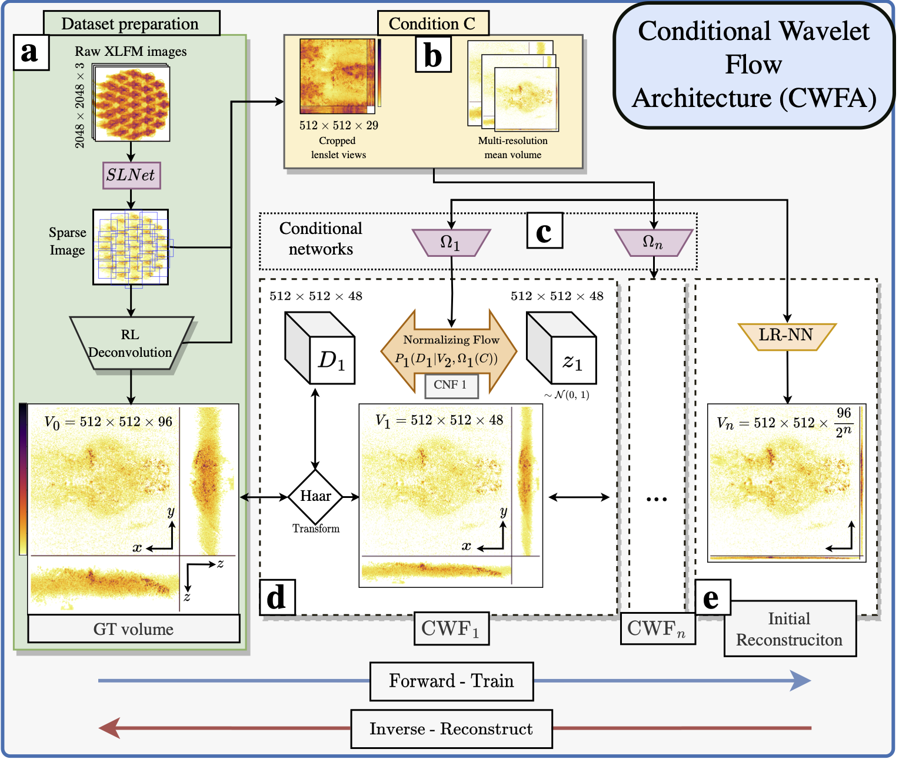

[![Apache License][license-shield]][license-url]
[![Google Scholar][gs-shield]][gs-url]
[![PDF][arxiv-shield]][arxiv-url]

# Conditional Wavelet Flow architecture for 3D reconstruction of XLFM images (CWFA)

* [About the Project](#about)
* [Installation](#installation)
* [Workflow](#workflow)
* [The dataset](#the-dataset)
* [Examples](#examples)
* [Citing this work](#citing-this-work)
* [Contact](#contact)

## About
In this work we propose using Conditional Wavelet Flows (CWF) for 3D reconstruction of imobilized fluorescent zebra fish. Using as an input 2D XLFM (Fourier Light Field) images. 
The PSF of the system is known, which enables 3D deconvolution in a relibable manner. However, it takes around 1 minute per frame, making it unpractical and slow. Hence, we attacked the problem with a new architecture.

Normalizing flows allow for exact likelihood computation for any sample. We exploited this capability for out of distribution detection and retraining. Requiring around 5 minutes of retraining when a novel sample is detected.

## Workflow
### Input
As input to the reconstruction we used [SLNet](https://github.com/pvjosue/SLNet_XLFMNet) processed images, which extract the sparse component of images (aka, neural activity), we then did a 3D Richardson-Lucy deconvolution of the images for 100 iterations. (As seen in panel (a)). Also a mean volume of the training set, which provides a spatial prior to the network (only posible because the fixed fish).

### Output
The output is a 3D reconstruction (512x512x96), taking around 0.16 seconds per frame.


### Training
Training the CWFA involves:
- Presenting a 3D volume, its corresponding XLFM image and the spatial prior (mean of 3D volumes in training set).
- Run the CWFA forward, which downsamples the volume and trains a normalizing flow in each step, which learns the Haar downsampling coefficients.
- Minimize the Negative-log-Likelihood of the output of each step Z.
- Train the last step (Low resolution neural network LRNN) as a traditional neural network.

### Reconstructing
Doing a 3D reconstruction involves running the CWFA backward:
- Generate the low resolution volume with the LRNN.
- Run each CWF upsampling step until reaching full resolution V_0.


## The dataset
The dataset can be found at Zenodo under: [Zenodo](https://zenodo.org/record/8024696)

## Examples
### Training the CWFA

### Finetuning the CWFA


## Installation
The project depends on multiple libraries that can be found under [requirements.txt](https://github.com/pvjosue/CWFA/blob/main/requirements.txt)
and installed by running
```
pip install -r requirements.txt
```
## Citing this work
```bibtex
@article{pageCWFA2023,
    author = {Page Vizcaíno, Josué and Symvoulidis, Panagiotis and Jelten, Jonas and Wang, Zeguan and Favaro, Paolo and Boyden, Edward S. and Lasser Tobias},
    booktitle = {arXiv},
    title = {{F}ast light-field 3D microscopy with out-of-distribution detection and adaptation through {C}onditional {N}ormalizing {F}lows},
    year = {2023}
}
```
## Contact
Josue Page - pv.josue@gmail.com

[forks-shield]: https://img.shields.io/github/forks/othneildrew/Best-README-Template.svg?style=flat-square
[forks-url]: https://github.com/pvjosue/WaveBlocks/network/members
[stars-shield]: https://img.shields.io/github/stars/othneildrew/Best-README-Template.svg?style=flat-square
[stars-url]: https://github.com/pvjosue/WaveBlocks/stargazers
[issues-shield]: https://img.shields.io/github/issues/othneildrew/Best-README-Template.svg?style=flat-square
[issues-url]: https://github.com/pvjosue/WaveBlocks/issues
[license-shield]: https://img.shields.io/github/license/othneildrew/Best-README-Template.svg?style=flat-square
[license-url]: https://github.com/pvjosue/WaveBlocks/blob/master/LICENSE
[gs-shield]: https://img.shields.io/badge/-GoogleScholar-black.svg?style=flat-square&logo=google-scholar&colorB=555
[gs-url]: https://scholar.google.com/citations?user=5WfCRjQAAAAJ&hl=en
[product-screenshot]: images/screenshot.png
[arxiv-shield]: https://img.shields.io/badge/-PDF-black.svg?style=flat-square&logo=arXiv&colorB=555
[arxiv-url]: https://arxiv.org/abs/2306.06408
